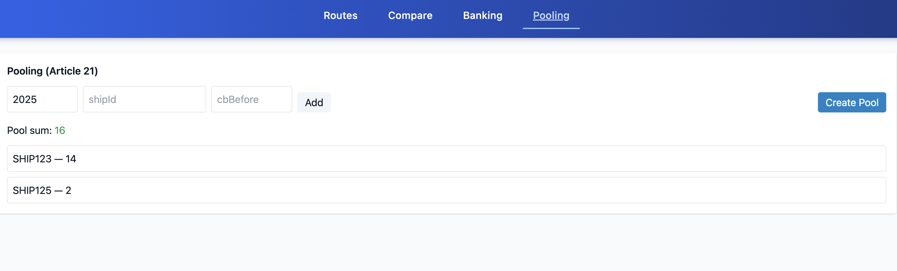

# FuelEU Maritime Compliance Dashboard

## Overview
This project implements the core mechanisms inspired by **EU Regulation 2023/1805**, focusing on decarbonization of maritime transport. It allows users to manage, visualize, and simulate compliance processes under the **FuelEU Maritime** framework.

### Key Features
- **Routes Management** – View and analyze GHG intensities of shipping routes.
- **Baseline Comparison** – Set a baseline route and compare GHG performance.
- **Article 20 – Banking** – Bank and apply Compliance Balances (CBs).
- **Article 21 – Pooling** – Form pools between ships to share compliance balances.

Each tab of the dashboard represents one part of the regulation logic.

---

## Tech Stack

**Frontend:** React + TypeScript + Recharts + TailwindCSS  
**Backend:** Node.js + Express + Prisma ORM  
**Database:** PostgreSQL  
**Other:** REST API architecture, CORS-enabled, Modular Folder Structure

---

##  Project Structure
```
frontend/
 ├── src/
 │   ├── pages/
 │   │   ├── RoutesTab.tsx
 │   │   ├── CompareTab.tsx
 │   │   ├── BankingTab.tsx
 │   │   └── PoolingTab.tsx
 │   ├── adapters/
 │   │   ├── infrastructure/apiClient.ts
 │   │   └── ui/useBanking.ts
 │   └── App.tsx
 ├── public/screenshots/
 └── index.css

backend/
 ├── src/
 │   ├── adapters/
 │   │   ├── inbound/http/
 │   │   └── outbound/postgres/
 │   ├── shared/utils/
 │   └── server.ts
 ├── prisma/schema.prisma
 └── package.json
```

---

## Screenshots

### 1-Routes Tab
Displays all available shipping routes with baseline selection.  


### 2-Compare Tab
Shows GHG intensity comparison and compliance chart.  


### 3-Banking Tab
Implements Article 20 – Banking (store and apply compliance balances).  


### 4-Pooling Tab
Implements Article 21 – Pooling (share adjusted compliance balances).  


---

## API Endpoints

### Routes
- `GET /api/routes` → Fetch all routes
- `POST /api/routes/:id/baseline` → Set a baseline route
- `GET /api/routes/comparison` → Fetch baseline + comparison data

### Banking (Article 20)
- `GET /api/banking/records?shipId=SHIP123&year=2025` → Fetch banked records
- `POST /api/banking/bank` → Bank surplus CB
- `POST /api/banking/apply` → Apply stored CB to offset deficit

### Pooling (Article 21)
- `GET /api/compliance/adjusted-cb?year=YYYY` → Fetch adjusted CBs
- `POST /api/pools` → Create a pool with members

---

## How to Run Locally

### 1-Backend Setup
```bash
cd backend
npm install
npx prisma generate
npx prisma migrate dev
npm run start
```

### 2-Frontend Setup
```bash
cd frontend
npm install
npm run dev
```

Then open [http://localhost:5173](http://localhost:5173) 🎨

---

##  Contributors
- **Manmeet Kaur** – Developer & Architect

---

## License
MIT License © 2025 Manmeet Kaur

